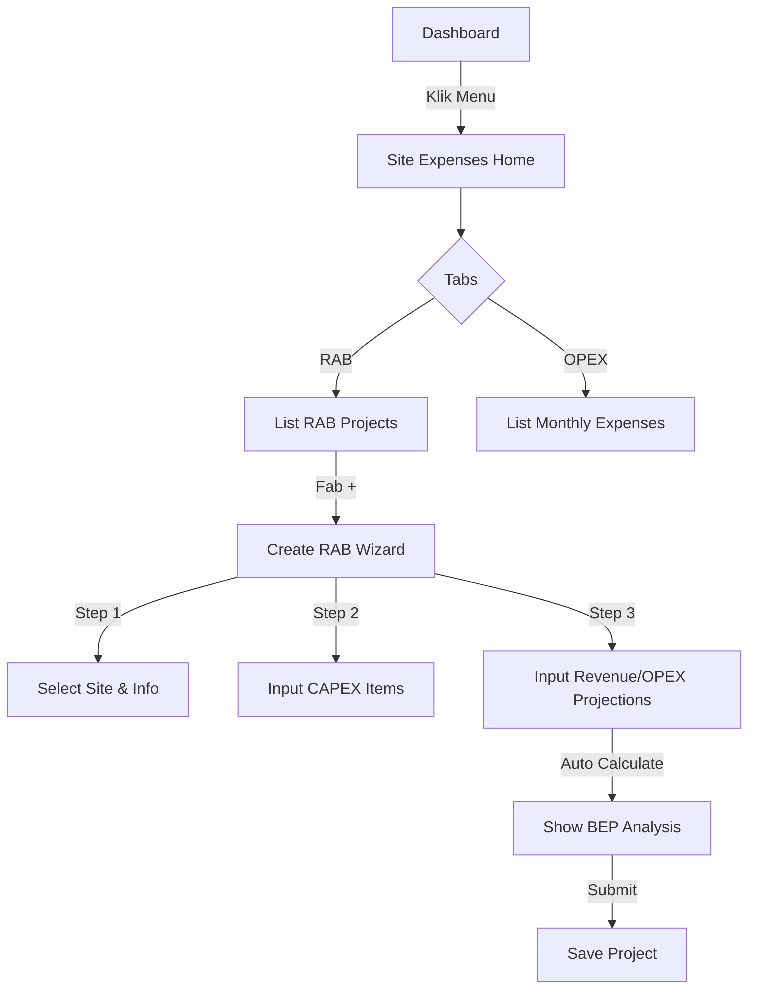

# Rencana Implementasi: Modul Pengeluaran Site & RAB (CAPEX)

## 1. Analisis Kebutuhan
User ingin menambahkan fitur **RAB (Rencana Anggaran Biaya)** untuk **CAPEX (Capital Expenditure)** per Site dengan perhitungan **BEP (Break-Even Point)**.
Fitur ini belum ada di aplikasi mobile, jadi kita akan membuat modul baru "Pengeluaran Site".

### Konsep Bisnis (Business Flow)
1.  **Entitas:** `RAB Project` (Proyek Anggaran).
2.  **Lingkup:** Per Site (Satu site bisa memiliki banyak project RAB, misal: "Pembangunan Awal", "Upgrade Alat", "Perbaikan Besar").
3.  **Komponen Perhitungan:**
    *   **Total CAPEX:** Jumlah biaya investasi (Perangkat, Jasa Instalasi, Izin).
    *   **Projected Revenue (Omset):** Estimasi pendapatan bulanan dari site tersebut setelah project berjalan.
    *   **Projected OPEX (Operasional):** Biaya rutin bulanan (Listrik, Sewa Lahan, Bandwidth).
    *   **Net Profit/Month:** Revenue - OPEX.
    *   **BEP (Break-Even Point):** Total CAPEX / Net Profit (Bulan).

## 2. Arsitektur Teknis
Modul ini akan dibangun di `app/(app)/site-expenses/` dengan struktur navigasi Tab.

### Struktur Folder
```
app/(app)/site-expenses/
├── _layout.tsx         # Stack navigation
├── index.tsx           # Dashboard Pengeluaran (Tabs: Overview, RAB, Realisasi)
├── rab/
│   ├── index.tsx       # List RAB Project
│   ├── create.tsx      # Form Pembuatan RAB (Multi-step wizard)
│   └── [id].tsx        # Detail RAB & Kalkulasi BEP
```

### Data Model (Frontend Interface)
```typescript
interface RABItem {
  id: string;
  name: string;
  category: 'DEVICE' | 'MATERIAL' | 'LABOR' | 'LICENSE' | 'OTHER';
  qty: number;
  price: number;
  total: number;
}

interface RABProject {
  id: string;
  siteId: string;
  siteName: string;
  title: string;          // Nama Project (e.g. "Upgrade Sektoral Utara")
  items: RABItem[];
  totalCapex: number;
  
  // Proyeksi Keuangan
  projectedRevenue: number; // Est. Pendapatan per bulan
  projectedOpex: number;    // Est. Biaya per bulan
  netIncome: number;        // Revenue - Opex
  
  // Hasil Hitung
  bepMonths: number;        // TotalCapex / NetIncome
  
  status: 'DRAFT' | 'PENDING' | 'APPROVED' | 'REJECTED' | 'IN_PROGRESS' | 'COMPLETED';
  createdAt: string;
}
```

## 3. Alur Pengguna (User Flow)

### A. Akses Menu
1.  Tambahkan menu **"Pengeluaran Site"** di `QuickMenu` Dashboard.
2.  Icon: `Wallet` atau `Building`.

### B. Membuat RAB Baru (Wizard)
1.  **Langkah 1: Info Proyek**
    *   Pilih Site (Dropdown/Search dari data MixRadius/Site).
    *   Nama Proyek.
2.  **Langkah 2: Item CAPEX**
    *   Tambah Item (Nama, Harga, Qty).
    *   Hitung otomatis Total CAPEX.
3.  **Langkah 3: Analisa Keuangan**
    *   Input Estimasi Revenue/Bulan.
    *   Input Estimasi OPEX/Bulan.
4.  **Langkah 4: Review & BEP**
    *   Tampilkan Ringkasan.
    *   Tampilkan **Indikator BEP** (misal: "BEP akan tercapai dalam 14 bulan").
    *   Tombol "Simpan Draft" atau "Ajukan Approval".

### C. Dashboard RAB
*   List Project RAB dengan statusnya.
*   Filter by Site.
*   Indikator visual status (Kuning=Pending, Hijau=Approved).

## 4. Rencana Kerja (Todo List)
Kita akan mulai dengan membuat struktur folder dan navigasi, lalu implementasi form RAB.


